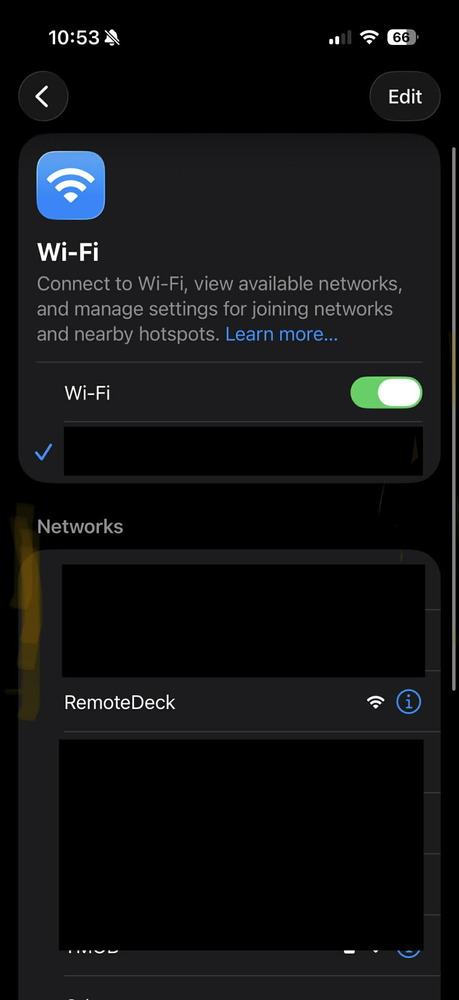
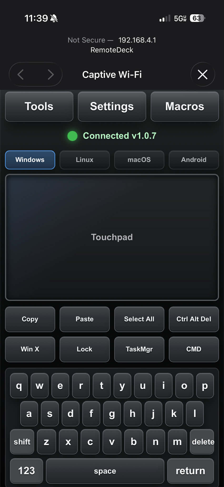
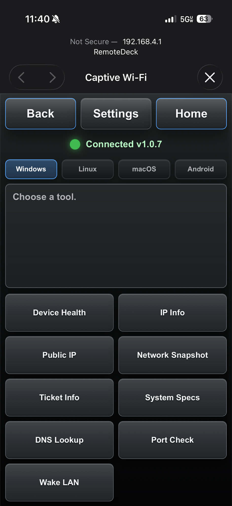
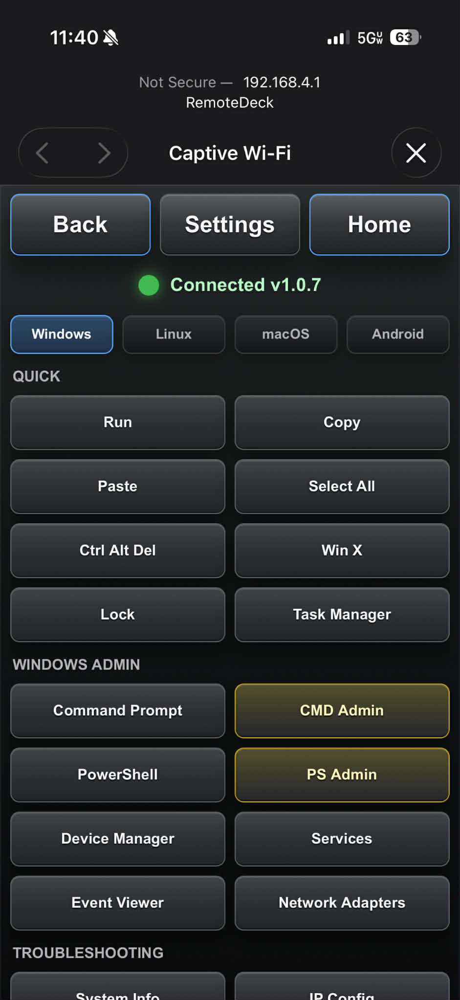

# RemoteDeck

RemoteDeck turns an ESP32-S3 dev board into a browser-controlled USB HID keyboard, mouse, troubleshooting deck, and field IT toolkit.

The ESP32 serves a local web app over WiFi. A phone, tablet, or desktop browser connects to that page, sends actions over WebSocket, and the ESP32 forwards them to the USB-connected host as keyboard and mouse input.









## What It Does

- Runs directly from an ESP32-S3 board with native USB HID support.
- Creates a password-protected `RemoteDeck` WiFi access point and serves the control UI locally.
- Provides a combined touchpad and responsive mobile keyboard screen.
- Includes eight fast IT shortcuts below the touchpad.
- Supports Windows, Linux/server, macOS, and Android TV profiles.
- Provides iPhone-style keyboard modes for letters, numbers, symbols, shift, and caps lock.
- Supports touchpad movement, tap-to-click, two-finger right click, and two-finger scroll.
- Includes an in-app Settings page for themes, pointer tuning, tap-to-click, natural scroll, startup page, admin macro confirmation, reset, and temporary HTTP lock.
- Includes IT-focused macros for common admin panels, shells, diagnostics, and repair commands.
- Includes an Android TV remote profile with D-pad, OK, Back, Home, Search, media, volume, and mute actions over USB HID.
- Includes tools for device health, IP info, public IP, network snapshot, ticket info, system specs launcher, DNS lookup, port check, and Wake-on-LAN.
- Includes captive portal behavior so phones and tablets can open the RemoteDeck page after joining WiFi.
- Performs WiFi/AP health checks and attempts to recover the access point if it drops.

## Hardware

Primary target:

- ESP32-S3 dev board with native USB support.
- Known-good target: Adafruit QT Py ESP32-S3 WiFi Dev Board with STEMMA QT, 8 MB flash, no PSRAM.


Recommended Arduino board target:

```text
esp32:esp32:adafruit_qtpy_esp32s3_nopsram
```

Generic ESP32-S3 boards can work when native USB and USB HID are enabled for the selected board profile.

ESP32-S2 boards can also work when native USB is exposed. On the Espressif ESP32-S2 Saola board, the built-in micro USB connector is connected to the serial chip, so USB HID requires wiring a separate USB connector to native USB pins:

| ESP32-S2 Saola | USB connector |
|---|---|
| GND | GND |
| 5V | VBUS |
| 19 (USB D-) | D- |
| 20 (USB D+) | D+ |
| not connected | ID |

Do not power a board through two USB connectors at the same time unless the board has the right protection circuitry.

## Arduino Dependencies

Install these through Arduino IDE or `arduino-cli`:

- Arduino ESP32 board package
- WebSockets by Markus Sattler
- ArduinoJson 7.x by Benoit Blanchon
- WiFiManager by tzapu/tablatronix

## Build And Upload

Using Arduino CLI:

```powershell
arduino-cli compile --fqbn esp32:esp32:adafruit_qtpy_esp32s3_nopsram RemoteDeck
arduino-cli upload --fqbn esp32:esp32:adafruit_qtpy_esp32s3_nopsram -p COMx RemoteDeck
```

Replace `COMx` with your board port.

Using Arduino IDE:

1. Open `RemoteDeck/RemoteDeck.ino`.
2. Select the ESP32-S3 board and serial port.
3. Install the dependencies above.
4. Compile and upload.
5. Connect the ESP32 to the computer that should receive HID input.
6. Join the `RemoteDeck` WiFi access point.
7. Enter the default WiFi password, `RemoteDeck123`.
8. Open `http://192.168.4.1` or `http://remotedeck.local`.

The web app uses:

- HTTP port `80`
- WebSocket port `81`
- DNS port `53` for captive portal detection

## Local Security

RemoteDeck intentionally serves the control page over HTTP because browser-trusted HTTPS is not practical for a self-hosted ESP32 hotspot at `192.168.4.1`. The safer field setup is to protect the WiFi link with WPA2 and keep the device on its own local network.

The default access point password is:

```text
RemoteDeck123
```

For field use, change it before publishing or deploying a build:

1. Copy `RemoteDeck/remotedeck_secrets.example.h` to `RemoteDeck/remotedeck_secrets.h`.
2. Set `REMOTEDECK_AP_PASSWORD` to a private 8-63 character password.
3. Optionally set `REMOTEDECK_CONTROL_PIN` to require a one-time browser unlock before keyboard, mouse, tool, or macro commands are accepted.

`remotedeck_secrets.h` is ignored by git so private credentials stay off GitHub.

The Settings page can temporarily turn off the HTTP server. The currently loaded page can still restore it over WebSocket, and a board reboot turns HTTP back on. Do not refresh the browser while HTTP is off unless you are ready to reboot or reconnect from an already-loaded page.

## Client Compatibility

The control surface is plain HTML, CSS, and JavaScript served directly by the ESP32. No native phone app is required.

Supported client targets:

- iPhone and iPad in Safari
- Android phones and tablets in Chrome or another modern browser
- Desktop browsers for setup, testing, and co-pilot control

The UI uses safe-area padding, dynamic viewport units, pointer events, and responsive keyboard rows so portrait and landscape layouts keep the same core experience.

## Tools And Macros

Network tools run from the ESP32. DNS lookup, public IP, port check, and Wake-on-LAN need the ESP32 station connection to have access to the target network. Wake-on-LAN works best when the ESP32 is joined to the same LAN or VLAN as the sleeping device.

The System Specs tool uses USB HID to open or target the selected OS shell:

- PowerShell on Windows
- Shell or terminal on Linux
- Terminal on macOS

It types a command that shows machine name, OS/version, CPU, and memory on the connected host. The ESP32 cannot read host output back into the web page unless a separate companion app is running on that host.

Windows troubleshooting macros use PowerShell for read-only diagnostics and elevated CMD for repair actions such as SFC, DISM, DNS flush, Winsock reset, and GPUpdate. Windows will still show UAC on the connected PC; approve it there before the elevated command runs.

RemoteDeck cannot directly detect the OS of the USB-connected host over HID. The profile auto-default is based on the browser device. Once you manually pick Windows, Linux, macOS, or Android TV, that choice is saved in the browser and reused.

The Android TV profile is intended for USB HID control. Plug the ESP32-S3 into the Android TV, streaming box, or Android device USB port, then use a phone/tablet browser on the RemoteDeck WiFi page as the remote. It does not use Android TV's WiFi pairing protocol.

## Health Endpoints

These endpoints return JSON health snapshots:

```text
/status.json
/health
```

They include firmware version, uptime, station/AP IPs, AP client count, RSSI, and free heap.

## Project Files

- `RemoteDeck/RemoteDeck.ino`: ESP32 firmware, USB HID handling, WiFi setup, HTTP server, WebSocket server, tools, and macros.
- `RemoteDeck/index_html.h`: embedded RemoteDeck web app served by the ESP32.
- `remotedeck.project.json`: optional RemoteDeck Studio manifest for import/testing workflows.
- `remotedeck.project.schema.json`: manifest schema used by the validator.
- `tools/validate-remotedeck-project.js`: dependency-free manifest validator.
- `acli.sh` and `test.sh`: original Arduino helper scripts.
- `images/`: screenshots and hardware reference images.

Validate the manifest with:

```powershell
node tools/validate-remotedeck-project.js
```

## Current Status

RemoteDeck is alpha software. It is working in live device testing, but it is still evolving quickly.

Known next steps:

- Broader ESP32-S3 board testing.
- Better release packaging.
- More field-tested IT macros.
- Optional companion app for richer host feedback.

## License

MIT. See `LICENSE`.
